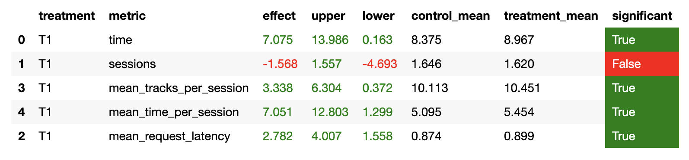

# Домашняя работа

## Эксперименты
Было проведено несколько экспериментов по улучшению неросетевого рекомендера.

1. В начале были попытки по улучшению нейросетевой части рекомендера. 
Были собраны дополнительные тренировочные данные с помощью прогонки разных рекомендеров. 
Также были взяты тренировочные данные из семинара по нейросетевому рекомендеру. 

2. Далее была модифицированная структура рекомендера ([ноутбук с обучением](./model_trainig.ipynb)):
   * Вместо обычных эмбединнг слоев был взят блок: эмбеддинг + дропаут + релу + линейный слой.
   * Вместо обычного скалярного произведения для предсказания длительности прослушивания
   использовалась косинусная близость.
  
    В результате итоговый лосс модели стал немного ниже, чем у модели на семинаре.
    После это были сгенерированы новые списки из топ 100 рекомендаций для каждой песни ([новые списки](../botify/data/tracks_with_recs_enhanced.json)).
Однако использование этого рекомендера не дало стат. значимого улучшения метрик в А/В тесте.

3. Следующей идеей улучшить рекомендер было: 
добавить запоминание последнего понравившегося трека для каждого пользователя 
и рекомендовать похожие треки именно к ним. Для простоты понравившееся треки 
хранились прямо в экземпляре рекомендера в словаре с фиксированным размером, 
при превышении размера словаря из него удалялись старые пользователи.
Были попробованы разные пороги прослушаемого времени, при котором трек можно считать понравившемся.
В результе и этот подход не дал стат значимых изменений (Прогонялось как на 4000 пользователей, так и на 60000).
Причем данных подход применялся как к новому списку рекомендации (пункт 2), так и к существующему из семинара.

4. Следующей идеей было добавить запоминание уже прослушанных треков пользователем и не рекомендовать ему один и тот же трек.
Однако и это не дало стат. значимых улучшений ([рекомендер c памятью](../botify/botify/recommenders/contextual_with_memory.py)).

5. Следующий способ: сделать пересечение списка рекомендаций 
нейросетевого рекомендера с семинара и обученного рекомендера, чтобы рекомендовать только те песни, которые оба рекомендера считают удачными. 
В результате в пересечении двух списков из топ 100 песен оказывались 1, 2 песни, чаще всего 0. Было решено отложить эту идею.

6. После этого было решено отойти от запоминания песен. Снова взять за основу стуктуру нейросетевого рекомендера из семинара 
и заменить в нем рандомный рекомендер каким-нибудь другим простым. Выбор пал на TopPop и StickyArtist. 
Был выбран TopPop, так как он дает результаты получше. Теперь если предыдущая песня не понравилась пользователю, 
нет смысла рекомендовать ему похожую песню, поэтому в этом случае включался TopPop рекомендер.
Однако и эта модификация не дала стат. значимого улучшения. Были попробованы разные пороги для определения плохой песни 
и разные длительности А/В эксперимента. Были также попробованы разные списки рекомендаций 
(из семинара и новый самостоятельно обученный).

7. Следующая идея для улучшения: если предыдущий трек прям совсем не подошел,
то и рекомендованные к нему треки нейросетевым рекомендером скорее всего тоже не подойдут. 
Поэтому в этом случае использовался TopPop рекомендер, и проверялось, 
что рекомендованный тек из TopPop не входит в список рекоменадиций нейросетевого рекомендера, если трек входит, то генериуется следующий трек.
В итоге и с этим улучшением рекомендер не давал стат значимых улучшений ([рекомендер с топ поп](../botify/botify/recommenders/contextual_and_popular.py)).

8. После этого возникло предположение, что в A/B эксперименте где-то есть ошибка. В итоге в treatment был поставлен рекомендер, который рекомендует всегда один и тот же трек,
однако в результатах эксперимента в поле T1 стояли разные рекомендации. После это дейстивтельно нашлась ошибка в коде A/B эксперимента.
В итоге, ВСЁ ЭТО ВРЕМЯ, во всех ранее проведенных экспериментах была ошибка в распределении по группам. И все эксперименты ранее были неправильными.

9. В итоге ошибка была устранена, была взят рекомендер из пункта 7. Проведен эксперимент и достигнуто стат значимое улучшение качества 
([данные эксперимента](./data/data.json), [ноутбук с экспериментом](../jupyter/Week1Seminar.ipynb)). 
Для сохранения нервов и времени все эксперименты заново было решено не проводить.

# Установка и запуск. 

Все устанавливается и запускается, как в изначальных инструкциях, использовался python 3.7.
Эксперимент уже настроен на сравнение рекомендера из ДЗ с рекоменедром из семинара.

Экспериентом проводился запуском два раза следующей команды:
~~~
python sim/run.py --episodes 1000 --config config/env.yml multi --processes 4
~~~